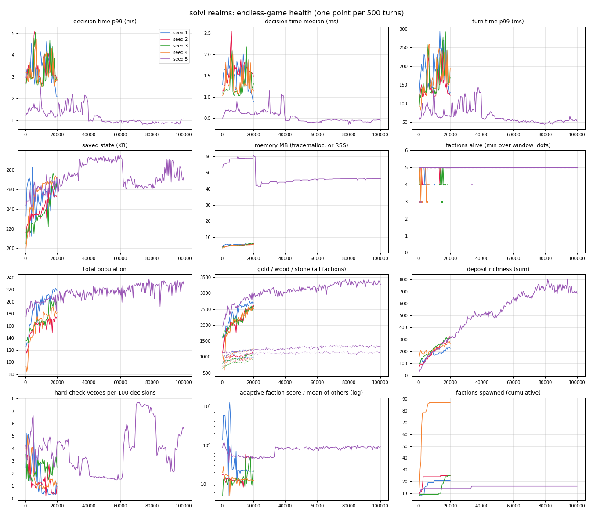
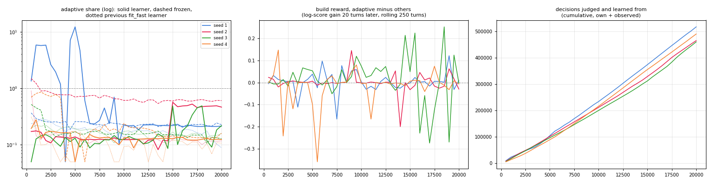
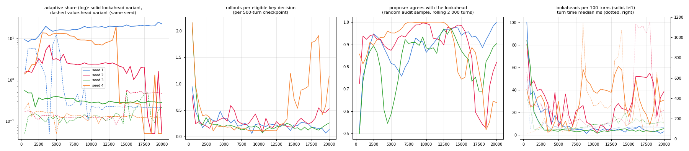

# solvi realms (runs in your browser)

An endless turn-based strategy game (a small 4X: map, resources, cities, units) whose AI factions are
[solvi](https://github.com/solvi-ai/solvi) decision systems. There is no win condition. The point is to watch the game
run indefinitely and show that it stays healthy. Everything runs in the visitor's browser with
[Gradio-Lite](https://www.gradio.app/guides/gradio-lite) (Pyodide): no server, no threads, no network after load.

## The game

- **Map**: a seeded 28×18 grid (8 neighbours) of plains, forest, hills, mountains, water and desert, with food, wood,
  stone and gold deposits. A worked deposit slowly depletes. An unworked one regenerates.
- **Factions**: builder, expansionist, warmonger, trader and one **adaptive** faction that learns while it plays. Cities
  work the tiles around them, grow, and build units (worker, settler, warrior, archer, caravan) and buildings (farm, lumber
  mill, mine, walls, market), or turn their production into gold. Upkeep is paid in gold, population eats food. Combat is
  simple and seeded (win odds = attack / (attack + defence), with fortification, terrain, walls and militia). Diplomacy is
  minimal: war and peace, each with its reason. A peace brings a 20-turn truce.
- **Endless**: when fewer than 3 factions are alive, a new one lands on free land. If no land is free, a far-away city of
  the largest empire rebels. Big empires also see random rebellions. Droughts, plagues, gold rushes, discoveries and
  harvests keep the world moving. Stockpiles above a storage capacity spoil, and a rich treasury rushes production. Every
  log and buffer is a ring buffer, so the saved state stays bounded.

## The factions are solvi systems

One catalog of small Python functions per personality: the functions are shared, and the personality lives in the
weights. Six questions:

| question | asked | answers |
|---|---|---|
| `build` | per city, when its queue is empty | worker, settler, warrior, archer, caravan, farm, lumber_mill, mine, walls, market, gold |
| `order_military` | per warrior/archer, every few turns | attack, defend, fortify, move, disband |
| `order_settler` | per settler | settle, move, fortify |
| `order_worker` | per worker | work, move, fortify, disband |
| `order_caravan` | per caravan | trade, move, disband |
| `stance` | per neighbour, every 5 turns | war, peace |

Computed facts include yields, food surplus, growth time, treasury after upkeep, a threat ratio (enemy strength near the
city against its defence), affordable options, scored settle sites, attack odds, the most threatened own city, strength
ratio and border tension. **Hard checks** (a failed one forces the answer, whatever the rule says):

| hard check | forces | rule |
|---|---|---|
| `treasury_ok` | build → gold | the treasury stays >= 0 after next turn's upkeep |
| `not_under_siege` | build → archer | a besieged city skips economic planning |
| `keeps_capital_defender` | order_military → fortify | the capital always keeps a defender |
| `settles_away_from_enemies` | order_settler → move | never found a city within 4 tiles of an enemy city |
| `worker_upkeep_ok` | order_worker → disband | a worker goes when the treasury cannot carry it |
| `war_needs_strength` | stance → peace | never declare or keep a war below 80% of the enemy's strength |

The **strategist's plan** matters. Each question's flow takes only the parts it needs: a worker's order runs 3 of the
47 catalog parts, a city's build 17. Hard checks run first. When a city is under siege or broke, **early exit** skips the
whole economic plan (yields, growth, affordable options, needs, scores), and the decision card lists the skipped steps.

**The adaptive faction** has no rule for `build`, `order_military` or `stance`. Each of the three is answered by a
learned **value head** (`realms/adaptive.py`): a solvi `FastHead` subclass that keeps, per answer option, a ridge
regression of the reward on the question's computed facts (city: growth, infrastructure, military need, threat, income,
cities, own strength against the others and against the weakest neighbour, free unit slots; unit: attack odds, target,
defence need, capital, war; stance: strength ratio, tension, war length, other wars, cities, border, grievance, trade).

- **Decision**: `System.ask` as for every faction. Hard checks run first and force the answer; otherwise the head picks
  the allowed option (affordable builds; attack only with a target, defend only for a threatened city, disband only
  surplus troops the income cannot carry) with the highest value + a small UCB bonus `0.005·sqrt(xᵀA⁻¹x)`. The `why`
  lists the facts that pushed the chosen option above the others (per-fact contributions of the learned weights), e.g.
  `stance = peace — their_cities = 1 (-0.06), at_war = True (+0.03), other_wars = 0 (+0.02), my_cities = 4 (-0.02)`.
  1% ε-exploration on builds.
- **Hard checks for the learned questions look only at the state** (the capital's last defender always stays; no war
  below 80% strength), so they veto whatever the head prefers, not a rule's preference.
- **Data**: every non-forced decision of **every** faction (its own, plus a sample of the others' — observational data)
  is kept in a bounded ring as its feature vector. 20 turns later (25 for stance) its reward is the deciding faction's
  log-score gain (score = population + 3 × cities) minus that faction's running mean gain (an advantage, so a faction
  that grows anyway does not make all its choices look good). Rewards update the ridge statistics; weights are re-solved
  every 25 turns with a slow decay (memory ~5 000 turns).
- **Bootstrap**: 200 synthetic states per question labelled by the balanced rule (its choice worth +0.05). The
  ablation "frozen after bootstrap" keeps exactly this prior for the whole game.

**Variant 2: the network proposes, the law verifies** (`realms/lookahead.py`, `sim.py --variant lookahead`; the value-head
faction above stays as the baseline arm). The same three questions, the same `System.ask` and hard checks, but:

- **Proposer**: a value head of the same form per question, trained on the lookahead's scores (distillation) instead of
  the faction's score 20 turns later. It ranks the options; the top 3 are the candidates.
- **Laws** remove candidates: the mask (affordable builds; attack needs a target, defend a threatened city), `upkeep_ok`
  (no build whose upkeep would push next turn's treasury below 0) and `war_min_length` (a war cannot end before 8 turns,
  so "peace" in a young war is the same as "war"). A failed hard check still forces the answer before any of this.
- **Verified lookahead**: when the proposer is unsure (the margin between its two best candidates is below the posterior
  width of that margin) or the decision is drawn for a 4% random audit, each surviving candidate is played out: 2
  rollouts × 10 turns on a copy of the game (every faction plays its normal policy, the adaptive one its proposer; the
  same RNG seeds for every candidate), scored by a fixed objective: own score − 0.5 × the others' mean score + territory,
  material, settlers on the road, stock, − danger to the capital. The best mean wins. Rollouts run on a cheap copy of the
  state with a trace-free replica of `System.ask` (checked equal to `System.ask` on 18 733 decisions) and are paid from
  a budget refilled every turn, scaled by the world's size, so the time per turn is bounded.
- **Distillation**: every evaluated candidate's score becomes a training target for the proposer; as its uncertainty
  shrinks, the gate asks for fewer rollouts.
- The `why` of every such decision names the candidates with their predicted values, the laws that removed candidates,
  and the lookahead scores, e.g. `proposer: attack +0.50, fortify +0.24, move -0.27; laws removed: none; not allowed:
  defend, disband; lookahead (unsure: margin 0.27 < width 0.53, 2×10 turns): attack +4.42, fortify +4.42, move +4.42 →
  attack`.

## In the browser

- The map is SVG. Click a city or unit to see its last solvi decision: the answer, `why`, the strategist's plan (steps
  and the reason each was taken), which hard checks passed or fired, the steps skipped by early exit, every computed fact,
  the `init_state` the engine passed in, and a live trace replay.
- Controls: next turn, play 10 or 100, **▶ Endless** (a `gr.Timer` that plays 1, 5 or 20 turns per tick), pause, new
  world by seed.
- Adaptive faction for a new world: the learning value heads (variant 1, default) or the **policy net + laws** (variant 3,
  below), optionally with its verified lookahead on a small budget (slower).
- **Health panel**: the same invariants as the headless test (below), checked live every 25 turns, with sparklines for
  decision time, turn time, factions alive, population, vetoes, state size and the adaptive faction's score.
- The event log records wars and peace with their reasons, captures, rebellions, new factions, events and vetoes.
- Take over a faction (you choose its builds and war/peace while solvi keeps advising). Save or load the game as JSON.

In Chromium (Pyodide): next turn 113 ms; 100 turns in 1.6 s (~15 ms/turn); endless auto-play ~25 turns/s. Live health at turn 591: 0 exceptions, decision p99 ×0.45 of the start, state 200→229 KB, min 3 factions alive, 376/376 replays OK, 0 abstentions in 20 477 decisions.

## Endless-game test

`sim.py` runs the game headless (plain CPython, no Gradio) and records a checkpoint every 500 turns. The invariants were
fixed before the runs (`realms/health.py`):

| id | invariant | test |
|---|---|---|
| I1 | no exceptions | engine exceptions = 0 and no solvi part raised |
| I2 | decision time flat | p99 decision time, last 10% of checkpoints <= 2 × first 10% |
| I3 | turn time flat | p99 turn time, same test |
| I4 | state bounded | serialized state: max over the last half <= 1.5 × max over the first half, and < 1 MB |
| I5 | memory bounded | tracemalloc (or process RSS): max over the last half <= 1.5 × max over the first half |
| I6 | >= 2 factions alive | at every turn |
| I7 | economy not degenerate | population, gold, wood, stone, deposit richness: over the last half no collapse (min > 5% of the mean) and no runaway (linear trend < 50% of the mean) |
| I8 | treasury never negative | no faction ends a turn below 0 gold |
| I9 | trace replay OK | 2% of all decisions, sampled at random, replayed with `trace.replay` |
| I10 | no abstentions | every question answered (ok or forced) |
| I11 | save/load exact | every 5 000 turns: save, reload, play 20 turns on the copy and on the original, compare state hashes |

Five endless runs with the learned adaptive faction: 20 000 turns × seeds 1–4 with memory tracing (tracemalloc, the
pre-registered evaluation below) and one 100 000-turn run (seed 5, process RSS). **All eleven invariants held on every run**: 0 exceptions, decision and turn time flat (p99 first vs last 10% within 2×; the runs shared the machine with up to five other simulations, so absolute times are inflated early on), saved state bounded (max 295 KB), memory bounded, never fewer than 3 factions alive, no degenerate economy, every save/load round-trip identical, and every sampled trace replay OK (223 155 of 223 155). On the 100 000-turn run the adaptive faction's share went from 0.58 (first 20%) to 0.87 (last 20%), peak 1.14.

| seed | turns | wall time | decision ms p50 first/last 10% | p99 first/last | max state | min alive | factions spawned | decisions | replay OK | held | failed |
|---|---|---|---|---|---|---|---|---|---|---|---|
| 1 | 20,000 | 42 min | 1.53 / 0.99 | 3.17 / 2.34 | 282 KB | 3 | 21 | 1,187,689 | 23749/23749 | I1, I2, I3, I4, I5, I6, I7, I8, I9, I10, I11 | — |
| 2 | 20,000 | 36 min | 1.20 / 1.54 | 3.14 / 2.98 | 264 KB | 3 | 25 | 996,110 | 19759/19759 | I1, I2, I3, I4, I5, I6, I7, I8, I9, I10, I11 | — |
| 3 | 20,000 | 37 min | 1.11 / 1.33 | 2.95 / 3.11 | 276 KB | 3 | 25 | 1,097,239 | 21881/21881 | I1, I2, I3, I4, I5, I6, I7, I8, I9, I10, I11 | — |
| 4 | 20,000 | 39 min | 1.12 / 1.14 | 3.00 / 2.80 | 273 KB | 3 | 87 | 1,126,624 | 22506/22506 | I1, I2, I3, I4, I5, I6, I7, I8, I9, I10, I11 | — |
| 5 | 100,000 | 81 min | 0.67 / 0.44 | 1.58 / 0.91 | 295 KB | 3 | 16 | 6,792,282 | 135260/135260 | I1, I2, I3, I4, I5, I6, I7, I8, I9, I10, I11 | — |



### Does the adaptive faction learn to beat the rules? (pre-registered test)

The criteria were written into `realms/adaptive.py` before the learner was changed and were not edited afterwards.
"share" = the adaptive faction's score / the mean score of the other factions (score = population + 3 × cities),
averaged over the first or last 20% of the 500-turn checkpoints; the other four factions and the maps are unchanged.

| id | criterion | result |
|---|---|---|
| A1 | share over the last 20% ≥ 1.0 in at least 3 of seeds 1–4 (20 000 turns) | **FAIL** — 0 of 4 (0.21, 0.48, 0.26, 0.12) |
| A2 | share last 20% > first 20% in all 4 seeds | **FAIL** — 2 of 4 (seeds 2 and 3 improve; 1 and 4 do not) |
| A3 | all 11 health invariants hold | **PASS** — all 11 on all 4 runs, and on the 100 000-turn run |
| A4 | every adaptive decision has a solvi `why` with the learned contributions; hard checks still veto it | **PASS** — audited on 2 000 turns: 52 377 answered decisions, every `why` names learned facts with signed contributions; 2 673 forced by a hard check, 2 140 of them against the head's own preference; 0 violations (`results/a4_check_seed1.json`) |

| seed | share first 20% | share last 20% | A1 ≥ 1.0 | A2 last > first | A3 invariants | frozen after bootstrap (first → last 20%) | previous fit_fast learner (first → last 20%) |
|---|---|---|---|---|---|---|---|
| 1 | 3.05 | **0.21** | no | no | all 11 held | 0.27 → 0.23 | 0.24 → 0.15 |
| 2 | 0.14 | **0.48** | no | yes | all 11 held | 0.96 → 0.61 | 0.24 → 0.12 |
| 3 | 0.11 | **0.26** | no | yes | all 11 held | 0.27 → 0.14 | 0.20 → 0.15 |
| 4 | 0.18 | **0.12** | no | no | all 11 held | 0.66 → 0.14 | 0.12 → 0.10 |



What the numbers say, plainly:

- **Better than before, not better than the rules.** The previous learner (a `fit_fast` build head taught from its
  own top-40% outcomes) sat at 0.10–0.24 share on every seed. The value heads reach 0.12–0.48 at the end of the four
  evaluation runs, and on seed 1 the adaptive faction led the map for most of the first ~5 500 turns (share 1–12) before
  wars reduced it to one city (about 0.2 from then on). It does not beat the rule-based factions on any of the four seeds.
- **Learning is not shown to beat the frozen bootstrap.** With the heads frozen after the bootstrap the shares at the
  end are 0.23, 0.61, 0.14, 0.17 — about the same as with learning (0.21, 0.48, 0.26, 0.12). On eight other seeds
  (5–12, 5 000 turns, used while developing) the learner improved from the first to the last 20% in 9 of 16 runs, the
  frozen heads in 2 of 8, but the final share was ≥ 1 in 5 of 16 learner runs and 3 of 8 frozen runs. Most of the jump
  over the old learner comes from handing unit orders and war/peace to value heads at all, not from what they learn
  in-game.
- **Outcomes are chaotic.** The same learner with a different exploration seed moved the median final share on seeds
  5–12 from 1.53 to 0.46. Every learner variant tried (own data only, advantage baseline, pairwise stance reward, danger
  features, more or less optimism, faster or slower forgetting) landed in the same band: roughly a third of worlds
  dominated (share 2–15), the rest stuck at 0.1–0.5 — usually after the warmonger conquers the adaptive faction's
  core and the respawned one-city faction cannot grow in a full world. A first full evaluation attempt with an earlier
  variant (no advantage baseline, more optimism, faster forgetting) gave seed 1: 2.07 → 14.19 and seed 2: 1.63 → 0.10 (collapse at turn
  14 500); it was stopped when seed 2 failed, and is kept in `results/attempt1/`.
- **Why it stays hard**: the reward is the whole faction's score 20 turns later, so one build or one order barely
  moves it; the signal that walls and archers prevent a conquest arrives rarely and late. Faction-level credit
  assignment is the weak point, not speed or memory (decisions stay ~1 ms, the saved state < 300 KB).

Raw checkpoints: `results/endless_<seed>.json` (evaluation and 100 000-turn run), `results/ablation/frozen_<seed>.json`
(frozen ablation), `results/baseline_fitfast/` (the previous learner's runs), `results/attempt1/`. Charts:
`results/health.{png,svg}`, `results/learning.{png,svg}` (solid: learner, dashed: frozen, dotted: previous learner).

### Variant 2: proposer + laws + verified lookahead (pre-registered test)

The criteria B1–B5 were written at the top of `realms/lookahead.py` before any run of this variant and were not edited
afterwards. Development used seeds 5–12 (3 000 turns); the evaluation ran once on seeds 1–4 × 20 000 turns with the
default `sim.py` settings (tracemalloc, save/load every 5 000 turns). The baseline arm is the value-head variant's
evaluation above (same seeds and turns; the engine change that added the planner hook was checked to leave that game
bit-for-bit unchanged: same state hash after 1 500 turns).

| id | criterion | result |
|---|---|---|
| B1 | share over the last 20% ≥ 1.0 in at least 3 of seeds 1–4 | **FAIL** — 1 of 4 (21.00, 0.88, 0.29, 0.23) |
| B2 | share over the last 20% above the value-head variant's on at least 3 of 4 seeds | **PASS** — 4 of 4 (21.00 vs 0.21, 0.88 vs 0.48, 0.29 vs 0.26, 0.23 vs 0.12; seeds 3 and 4 only barely) |
| B3 | audit agreement higher in the last 20% than the first (pooled), and rollouts per eligible decision down ≥ 30% (pooled and in ≥ 3 seeds) | **FAIL** — agreement 89.4% → 78.7%; rollouts per decision 0.382 → 0.388 (+2%); down ≥ 30% in 2 of 4 seeds |
| B4 | all 11 invariants on every run; key-decision time with lookahead and turn time flat within 2×; state < 1 MB | **FAIL** — seed 4 fails I2 (decision p99 3.9 → 42 ms); seeds 1–3 hold all 11. Key-decision p99 with the lookahead: seed 2 1 139 → 1 112 ms, seed 4 590 → 1 071 ms; on seeds 1 and 3 it drops below 1 ms (fewer than 1% of decisions use the lookahead late), so that part holds trivially |
| B5 | every planner decision's `why` names candidates, predicted values, laws and lookahead scores; hard checks still force | **PASS** — 2 000 turns of seed 1: 38 948 decisions (1 013 with the lookahead, 795 forced by a hard check, the planner never consulted on those), 0 violations (`results/lookahead/b5_check_seed1.json`) |

| seed | wall time | share first → last 20% | value-head variant last 20% | rollouts per eligible decision, first → last 20% | audit agreement, first → last 20% | lookaheads (eligible decisions) | invariants |
|---|---|---|---|---|---|---|---|
| 1 | 72 min | 12.35 → **21.00** | 0.21 | 0.38 → 0.18 (−53%) | 425/477 → 115/123 | 2 229 (35 728) | all 11 held |
| 2 | 178 min | 3.07 → **0.88** | 0.48 | 0.28 → 0.34 (+23%) | 687/745 → 110/155 | 5 588 (107 474) | all 11 held |
| 3 | 76 min | 0.39 → **0.29** | 0.26 | 0.63 → 0.17 (−73%) | 250/312 → 124/154 | 1 605 (23 066) | all 11 held |
| 4 | 162 min | 6.43 → **0.23** | 0.12 | 0.52 → 0.75 (+43%) | 266/288 → 50/75 | 6 019 (161 559) | I2 failed |



What the numbers say, plainly:

- **Stronger than the value heads, not reliably stronger than the rules.** On every evaluation seed the lookahead
  faction ends above the value-head faction, and for long stretches it dominates: seed 1 the whole run (share 8–24),
  seed 4 from turn 2 500 to 13 500 (share 7–19), seed 2 for 17 000 turns (share 1.3–5). But seeds 2 and 4 lost it late
  (seed 4 from 19 to 0.3 within 1 000 turns, then eliminated and replaced by a one-city newcomer; seed 2 eliminated at
  turn 18 000), and seed 3 never got going (0.3 throughout). With the last 20% as the yardstick, only seed 1 counts.
  On the development seeds (5–12, 3 000 turns, four configurations) the final share was ≥ 1 in 16 of 30 runs, against
  6 of 16 for the value heads (seeds 5–12, two runs each).
- **Distillation works early, then the world moves on.** On all four seeds rollouts per eligible decision fall from
  about 2 at turn 500 to about 0.3 by turn 2 500, and the audited agreement of the proposer with the lookahead climbs to
  90–100%. The criterion compares the first and last 20% (4 000 turns each), so most of that drop sits inside the first
  window. Where the faction later collapsed (seeds 2 and 4), the respawned faction is in situations the proposer has not
  seen: agreement falls to 67–71% and rollouts per decision rise again.
- **The I2 failure is not the planner's**: while these runs were going, the solvi library in the same repository gained
  an online learner inside `System.ask` (a check-order model refitted as asks accumulate). A replica of seed 4 with that
  learner switched off (`system.learn = False`, now set in `realms/brains.py`) played the identical game — same share,
  population and decision counts at every checkpoint up to turn 12 500 — with decision p99 flat at 3–5 ms instead of
  40–95 ms (`results/lookahead/learnoff/`). The replica also showed the real risk: turn time grows with the size of a
  dominating empire (turn p99 first/last 10% ×2.03 at turn 12 500, just over the limit).
- **Health otherwise**: 0 exceptions, 4 061 278 decisions, every sampled trace replay OK (80 997 of 80 997), every
  save/load round trip identical, saved state ≤ 188 KB, never fewer than 3 factions alive.
- **A limitation found while optimising**: a unit next to an enemy re-plans on its next turn, and in the rollout the
  candidate order is applied but the unit does not act before that re-plan, so its candidate orders roll out to the
  same game (the lookahead now detects such identical rollouts and skips them — 13% of rollouts). Letting the unit act
  on the candidate order at once in the rollout would fix it, but changes decisions: a future variant, not run here.

**Speed** (same decisions, verified: identical state hash and planner counters after 1 000 turns of seed 6): 79.5 s →
53.2 s per 1 000 turns (×1.5): solvi's ask-time learner switched off for the realms systems, a precomputed distance
table, memoised war keys, a memo of the tiles next to cities, the rollout replica of `System.ask` compiled into one
function per flow, and rollouts of the candidates run in lockstep, where a rollout whose whole game state equals another
candidate's (same seed) is dropped and takes its value (exact, as the game is deterministic).

**Resumable runs**: `sim.py --checkpoint PATH` writes the whole run (game with learner and planner, the metrics' replay
RNG, the records) every `--checkpoint-every` turns; `--resume PATH` continues bit-for-bit (seed 7: 1 000 turns straight
vs 500 + resume + 500 → identical state hash and all 48 deterministic fields of every record); `--max-wall S` pauses at
the next checkpoint (exit 3). The 100 000-turn health run of this variant runs on Colab in ~45-minute segments this way
(`results/lookahead/colab/driver.sh`).

**100 000-turn health run (lookahead variant, seed 5, Colab CPU, 9 segments, 6.3 h): all eleven invariants held.** 0 exceptions;
decision time p50 1.6 ms / p99 3.5 ms at the end (flat); state 177 KB; memory 48 MB; 5 factions alive; every sampled trace replay
OK. The lookahead faction dominated by the end: share 19.7× the mean of the others. One world only — on the four 20 000-turn
seeds it held the lead to the end on one of four (B1), so read it as "longer games favour it", not as a general win. With the
solvi online-learning default fixed (off unless a learned policy uses it), B4's only earlier failure (seed 4, I2) is explained
and does not recur.

Raw data: `results/lookahead/endless_<seed>.json`, `results/lookahead/logs/`, `results/lookahead/b5_check.py`,
`results/lookahead/learnoff/` (the replica), `results/dev_la/` (development runs), `results/lookahead/dev/` (speed and
resume checks). Charts: `results/lookahead/lookahead.{png,svg}`, `results/lookahead/health.{png,svg}`.

### Variant 3 (policy net + laws): a small policy net proposes, laws and a check decide (pre-registered test)

`realms/policy.py` + `realms/policy_net.json`, `sim.py --variant policy` (and `policy_la`); selectable in the app ("adaptive faction",
applies to a new world). The same three questions and the same `System.ask` with its hard checks, but the answer comes from a
**small learned policy**: one MLP per question (input → 64 → 64 → one score per option, about 23 000 weights in all, pure
numpy: no torch, no onnxruntime in the browser). Its inputs are the question's facts, the balanced rule's score per option
and 27 global features of the faction's position (score and share, strength, capital threat, wars, stock, fleet, a warmonger
in contact).

- **Laws before the net** remove options: the mask, `upkeep_ok`, `war_min_length`, and two new ones — `capital_guard` (when
  the capital is threatened — enemy strength within 3 tiles at least its defence — the capital builds archer / warrior /
  walls if it can, its defenders within 1 tile only fortify or defend, no new war) and `no_starve` (a city with a negative
  food surplus builds a farm when it can).
- **A check after the net** (`audit`, separate code) re-verifies every final answer against those laws; violations are
  counted and shown in the app. A failed hard check still forces the answer before the net is consulted.
- **`why`** of every such decision: the options with the net's scores, the laws that removed options, the check and the
  pick, e.g. `policy net: settler +0.15, warrior +0.05, gold +0.03, caravan -0.17; laws removed: none; not allowed:
  archer, farm, lumber_mill, walls, market; check: ok → settler`.
- **Training (offline, not in the Space)**: approximate policy iteration with rollout labels. For sampled decisions every
  allowed option (up to 6) was played out 3 × 30 turns on a copy of the game (common random numbers, scored by
  `lookahead.value()`); the net learns to rank them; then the games are replayed with the net and it is trained again.
  Two iterations, 278 000 labels, map seeds 100–399, about 5 machine-hours on Colab CPUs. The net was chosen on seeds
  500–523 before the evaluation below, which ran once.
- **`policy_la`** (optional, "policy net + verified lookahead" in the app): when the net is unsure (margin < 0.15) or on a 4% random
  audit, its top 3 options are played out 2 × 15 turns and the best one wins, paid from a rollout budget (30 per turn
  headless, 10 in the browser). It is off by default: with the browser budget a turn takes ~2.5× longer (CPython, first
  150 turns of seed 3: 36 vs 14 ms) and a verified decision pauses up to ~0.3 s (more in Pyodide).

**Held-out maps: seeds 1001–1032 × 5 000 turns** (share over the second half; "leads" = the adaptive faction has the top
score at most of those checkpoints; 95% Wilson intervals):

| adaptive faction | median share | share ≥ 1 | leads | capital lost / 10k turns | turn p50 |
|---|---|---|---|---|---|
| value heads (variant 1) | 0.69 | 10/32 [0.18, 0.49] | 3/32 | 22.1 | 45 ms |
| balanced rules (solvi learned check order) | 0.48 | 13/32 [0.26, 0.58] | 6/32 | 6.8 | 35 ms |
| balanced rules + the policy net's laws | 0.57 | 14/32 [0.28, 0.61] | 7/32 | 4.1 | 35 ms |
| proposer + lookahead (variant 2) | 5.39 | 24/32 [0.58, 0.87] | 21/32 | 3.5 | 54 ms |
| **policy net + laws** | **13.39** | **26/32 [0.65, 0.91]** | **23/32** | 5.9 | 60 ms |
| policy net + laws + lookahead | 14.56 | 30/32 [0.80, 0.98] | 29/32 | 4.4 | 85 ms |

- Pairwise over the 32 maps (mean difference of log share, bootstrap 95%): policy net vs value heads +2.25 [1.60, 2.88], vs the
  balanced rules +2.30 [1.70, 2.92], vs variant 2 **+0.46 [−0.17, 1.07]** — better on 22 of 32 maps but *not
  significant*. policy net + lookahead vs variant 2: +0.99 [0.53, 1.49].
- The laws alone add little (rules + laws vs rules: +0.17); the gain is the net's.
- **0 check violations** in 9 358 304 net decisions (all policy-net runs); treasury never negative, trace replays, save/load exact.
- **Decision time**: the net's decision (laws + rule scores + forward pass) 0.11 ms median, 0.27 ms p99 in CPython on one
  core; the forward pass alone 7.5 µs. Not measured in a browser (Pyodide is typically 2–5× slower: still well under 2 ms).
  The lookahead mode's decisions take up to ~0.9 s when it runs.
- Honest caveats: the policy-net faction loses its capital more often than variant 2 (5.9 vs 3.5 per 10k turns — `capital_guard`
  does not make combat deterministic), its big cities starve a little more often than the others' (10.0 vs 7.5 per 1 000
  city-turns: they grow to the limit), and turn time grows with its empire (I3 failed on 6 of the 32 5 000-turn maps).

**Long horizon: seeds 1–4 × 20 000 turns** (share over the last 20%, the A1/B1 yardstick; same maps as above):

| seed | policy net + laws | value heads | variant 2 | rules + laws |
|---|---|---|---|---|
| 1 | **19.75** | 0.21 | 21.00 | 0.17 |
| 2 | **5.59** | 0.48 | 0.88 | 0.81 |
| 3 | 0.31 | 0.26 | 0.29 | 0.12 |
| 4 | **19.02** | 0.12 | 0.23 | 0.14 |

Share ≥ 1 on 3 of 4 seeds (variant 2: 1 of 4) and all eleven health invariants held on all four runs. Seed 3 is the known
failure mode: the policy-net faction led until turn ~8 000, then its core was conquered and the respawned one-city factions were
eliminated 51 times; every arm fails on that map. Of the seven pre-registered criteria five passed; the two that
failed are "significantly better than variant 2" and "never eliminated after turn 1 000 in the long runs".

`Game(variant="policy")` reproduces the evaluation games bit for bit: on seeds 1001 and 1002 × 1 500 turns the game state is
identical to the policy net's evaluation arm's at every 50th turn (only the event log's `why` text gains "; check: ok"), and share and
population equal the evaluation's at every checkpoint; 0 violations, save/load exact.

## Layout

- `index.html`: loads `@gradio/lite@5.45.0` from jsDelivr, requires `solvi==0.8.0` (bumped with each release), and mounts `app.py` and `realms/*.py`.
  It keeps the arcade's PyPI "time machine" (the simple index is filtered to files uploaded before the Gradio-Lite release,
  solvi exempt), without which micropip cannot resolve gradio 5.45.
- `app.py`: the Gradio 5 UI.
- `realms/world.py` (map, distance fields), `realms/econ.py` (rules), `realms/brains.py` (catalogs, questions, hard
  checks), `realms/adaptive.py` (the adaptive faction's value heads, pre-registered criteria A1–A4), `realms/lookahead.py`
  (variant 2: proposer, laws, verified lookahead, pre-registered criteria B1–B5), `realms/policy.py` + `realms/policy_net.json`
  (variant 3: the policy net, laws and answer check; optional budgeted lookahead), `realms/engine.py` (turn loop, combat, events, spawning, save/load), `realms/health.py` (invariants,
  checkpoints), `realms/render.py` (SVG map, cards, sparklines).
- `sim.py`: the headless long-run test and the charts.

## Run locally

```bash
cd solvi/spaces/realms
python -m http.server 8080                 # the browser app: open http://localhost:8080
# headless (from the solvi repo, which has solvi installed):
OPENBLAS_NUM_THREADS=1 uv run python spaces/realms/sim.py --seed 1 --turns 100000 --no-tracemalloc
uv run --with matplotlib python spaces/realms/sim.py --charts
uv run python spaces/realms/sim.py --table          # health table + criteria A1-A3 + ablation + criteria B1-B4
# variant 2 (proposer + laws + lookahead), resumable:
OPENBLAS_NUM_THREADS=1 uv run python spaces/realms/sim.py --variant lookahead --seed 1 --turns 20000 --checkpoint ck_1.json
OPENBLAS_NUM_THREADS=1 uv run python spaces/realms/sim.py --resume ck_1.json --turns 20000 --out spaces/realms/results/lookahead/endless_1.json
uv run python spaces/realms/results/lookahead/b5_check.py 1 2000   # B5 audit
# variant 3 (policy net + laws), and with the budgeted lookahead:
OPENBLAS_NUM_THREADS=1 uv run python spaces/realms/sim.py --variant policy --seed 1001 --turns 5000 --every 250 --no-tracemalloc
OPENBLAS_NUM_THREADS=1 uv run python spaces/realms/sim.py --variant policy_la --seed 1001 --turns 5000 --every 250 --no-tracemalloc
# ablation: the adaptive heads frozen after the bootstrap
uv run python spaces/realms/sim.py --seed 1 --turns 20000 --frozen --out spaces/realms/results/ablation/frozen_1.json
```
